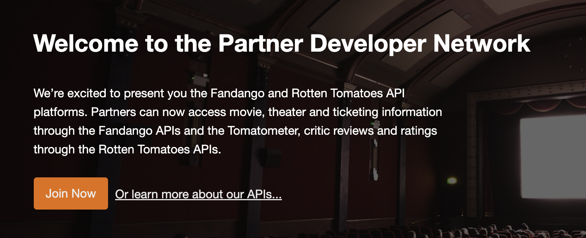

<div align="center">

[](https://developer.fandango.com&#x2F;rotten_tomatoes)

# [Rotten tomatoes](https://developer.fandango.com&#x2F;rotten_tomatoes)

Test our API services using I/O Docs.

</div>

## Requirements

Building the API client library requires:

1. Java 1.8+
2. Maven (3.8.3+)/Gradle (7.2+)

If you are adding this library to an Android Application or Library:

3. Android 8.0+ (API Level 26+)

## Installation<a id="installation"></a>
<div align="center">
  <a href="https://konfigthis.com/sdk-sign-up?company=Rotten%20Tomatoes&language=Java">
    
  </a>
</div>

### Maven users

Add this dependency to your project's POM:

```xml
<dependency>
  <groupId>com.konfigthis</groupId>
  <artifactId>rotten-tomatoes-java-sdk</artifactId>
  <version>1.0</version>
  <scope>compile</scope>
</dependency>
```

### Gradle users

Add this dependency to your `build.gradle`:

```groovy
// build.gradle
repositories {
  mavenCentral()
}

dependencies {
   implementation "com.konfigthis:rotten-tomatoes-java-sdk:1.0"
}
```

### Android users

Make sure your `build.gradle` file as a `minSdk` version of at least 26:
```groovy
// build.gradle
android {
    defaultConfig {
        minSdk 26
    }
}
```

Also make sure your library or application has internet permissions in your `AndroidManifest.xml`:

```xml
<!--AndroidManifest.xml-->
<?xml version="1.0" encoding="utf-8"?>
<manifest xmlns:android="http://schemas.android.com/apk/res/android"
    xmlns:tools="http://schemas.android.com/tools">
    <uses-permission android:name="android.permission.INTERNET"/>
</manifest>
```

### Others

At first generate the JAR by executing:

```shell
mvn clean package
```

Then manually install the following JARs:

* `target/rotten-tomatoes-java-sdk-1.0.jar`
* `target/lib/*.jar`

## Getting Started

Please follow the [installation](#installation) instruction and execute the following Java code:

```java
import com.konfigthis.client.ApiClient;
import com.konfigthis.client.ApiException;
import com.konfigthis.client.ApiResponse;
import com.konfigthis.client.RottenTomatoes;
import com.konfigthis.client.Configuration;
import com.konfigthis.client.auth.*;
import com.konfigthis.client.model.*;
import com.konfigthis.client.api.DvdListsApi;
import java.util.List;
import java.util.Map;
import java.util.UUID;

public class Example {
  public static void main(String[] args) {
    Configuration configuration = new Configuration();
    configuration.host = "http://api.rottentomatoes.com/api/public/v1.0";
    
    configuration.key  = "YOUR API KEY";
    RottenTomatoes client = new RottenTomatoes(configuration);
    String pageLimit = "16"; // The amount of new release dvds to show per page
    String page = "1"; // The selected page of current DVD releases
    String country = "us"; // Provides localized data for the selected country (ISO 3166-1 alpha-2) if available. Otherwise, returns US data.
    try {
      client
              .dvdLists
              .getCurrentReleases()
              .pageLimit(pageLimit)
              .page(page)
              .country(country)
              .execute();
    } catch (ApiException e) {
      System.err.println("Exception when calling DvdListsApi#getCurrentReleases");
      System.err.println("Status code: " + e.getStatusCode());
      System.err.println("Reason: " + e.getResponseBody());
      System.err.println("Response headers: " + e.getResponseHeaders());
      e.printStackTrace();
    }

    // Use .executeWithHttpInfo() to retrieve HTTP Status Code, Headers and Request
    try {
      client
              .dvdLists
              .getCurrentReleases()
              .pageLimit(pageLimit)
              .page(page)
              .country(country)
              .executeWithHttpInfo();
    } catch (ApiException e) {
      System.err.println("Exception when calling DvdListsApi#getCurrentReleases");
      System.err.println("Status code: " + e.getStatusCode());
      System.err.println("Reason: " + e.getResponseBody());
      System.err.println("Response headers: " + e.getResponseHeaders());
      e.printStackTrace();
    }
  }
}

```

## Documentation for API Endpoints

All URIs are relative to *http://api.rottentomatoes.com/api/public/v1.0*

Class | Method | HTTP request | Description
------------ | ------------- | ------------- | -------------
*DvdListsApi* | [**getCurrentReleases**](docs/DvdListsApi.md#getCurrentReleases) | **GET** /lists/dvds/current_releases.json | 
*DvdListsApi* | [**getNewReleasesJson**](docs/DvdListsApi.md#getNewReleasesJson) | **GET** /lists/dvds/new_releases.json | 
*DvdListsApi* | [**getTopRentalsJson**](docs/DvdListsApi.md#getTopRentalsJson) | **GET** /lists/dvds/top_rentals.json | 
*DvdListsApi* | [**getUpcomingDvds**](docs/DvdListsApi.md#getUpcomingDvds) | **GET** /lists/dvds/upcoming.json | 
*DetailedInfoApi* | [**findSimilarMovies**](docs/DetailedInfoApi.md#findSimilarMovies) | **GET** /movies/{id}/similar.json | 
*DetailedInfoApi* | [**getClipById**](docs/DetailedInfoApi.md#getClipById) | **GET** /movies/{id}/clips.json | 
*DetailedInfoApi* | [**getMovieAliasInfo**](docs/DetailedInfoApi.md#getMovieAliasInfo) | **GET** /movie_alias.json | 
*DetailedInfoApi* | [**getMovieByIdJson**](docs/DetailedInfoApi.md#getMovieByIdJson) | **GET** /movies/{id}.json | 
*DetailedInfoApi* | [**getMovieCast**](docs/DetailedInfoApi.md#getMovieCast) | **GET** /movies/{id}/cast.json | 
*DetailedInfoApi* | [**getMovieReviews**](docs/DetailedInfoApi.md#getMovieReviews) | **GET** /movies/{id}/reviews.json | 
*MovieListsApi* | [**getBoxOfficeJson**](docs/MovieListsApi.md#getBoxOfficeJson) | **GET** /lists/movies/box_office.json | 
*MovieListsApi* | [**getIntheaterMovies**](docs/MovieListsApi.md#getIntheaterMovies) | **GET** /lists/movies/in_theaters.json | 
*MovieListsApi* | [**getOpeningMovies**](docs/MovieListsApi.md#getOpeningMovies) | **GET** /lists/movies/opening.json | 
*MovieListsApi* | [**getUpcomingMovies**](docs/MovieListsApi.md#getUpcomingMovies) | **GET** /lists/movies/upcoming.json | 
*SearchApi* | [**moviesJson**](docs/SearchApi.md#moviesJson) | **GET** /movies.json | 
*TopLevelListsApi* | [**getData**](docs/TopLevelListsApi.md#getData) | **GET** /lists.json | 
*TopLevelListsApi* | [**getDvds**](docs/TopLevelListsApi.md#getDvds) | **GET** /lists/dvds.json | 
*TopLevelListsApi* | [**getMoviesJson**](docs/TopLevelListsApi.md#getMoviesJson) | **GET** /lists/movies.json | 


## Documentation for Models


## Author
This Java package is automatically generated by [Konfig](https://konfigthis.com)
